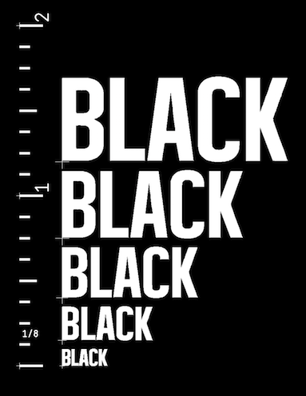

# BLACK LIVES MATTER Eagle Library

This is a library for Autodesk Eagle that provides BLACK LIVES MATTER silkscreens and copper footprints for printed circuit boards.

A common attitude in DIY and Maker™ circles is that the world of technology is independent of politics and should remain free of political messages like BLACK LIVES MATTER. In fact, there is political ideology embedded in all technology—in the work that we do, the tools that we use, and the access that people have to our projects. (Yes, that includes your DIY cat feeder, garage door opener, or protocol analyzer.) Technology often serves to reinforce existing social structures, including class-based and racist power structures. Examples of this occasionally rise to the surface in [easy](https://www.theatlantic.com/technology/archive/2009/12/are-hewlett-packard-webcams-racist/341579/). [to](https://www.technologyreview.com/2020/06/03/1002589/technology-perpetuates-racism-by-design-simulmatics-charlton-mcilwain/). [identify](https://www.aclu.org/news/privacy-technology/how-is-face-recognition-surveillance-technology-racist/). [ways](https://medium.com/@CoalitionForCriticalTechnology/abolish-the-techtoprisonpipeline-9b5b14366b16).

Including a BLACK LIVES MATTER message on your PCBs can serve as a small gesture of solidarity and hope. It may prompt other engineers, designers, tinkerers, and hackers who look at your project to pause and consider how technology and racism are connected. It can serve as a provocation for those who would object to such a message appearing on objects that they consider purely technical and apolitical—forcing them to ask themselves why they find this simple slogan challenging. It can become an intervention into the technical-only discussions that occur in online electronics forums, drawing attention to the current state of racism and police violence. It might also inspire a young black future inventor, engineer, or artist that takes apart an electronic object to understand how it works and is presented with a message that, yes, their hands and their voice belong there.

### Technical Info

* Install the library by copying the `BLACK_LIVES_MATTER.lbr` file into your Eagle `lbr` folder
* To use the library in an Eagle project, open the Library Manager, find the library in the "Available" tab and click "Use"
* There are 5 sizes available for each of the three words: XS, S, M, L, XL. They are *roughly* .1", .2", .3", .4", and .5" respectively.
* Choose SILK to have that word appear on the tPlace (top silkscreen) layer or COPPER to have it appear on the Top (top copper) layer.
* To move a word to the opposite side of the board, simply choose the Mirror command, then clicking the plus sign at the lower left of the text. This will flip the text and automaticaly switch it between the tPlace/bPlace or Top/Bottom layers.
* Note that the COPPER version of the texts will normally appear *under* the solder mask, so it will be very subtle. Consider making a Polygon around the text and putting it on the tStop or bStop layers to keep solder mask from being applied in that area.

### Projects

If you use the library or otherwise include BLACK LIVES MATTER on your PCB project, please add an Issue with the "project" tag and include the URL. I'd like to add it to the list here:

* A [Portable RJ45-to-Eurorack Bridge](https://github.com/rahji/rj45eurorackbridge) that allows two modular sythesists to collaborate across a safe distance during the COVID-19 pandemic (made before this library, so it looks different)

### License

This library is released under the GPL-3.0 License. I encourage anyone to use it on personal and commercial projects. Please always include all three elements so that the text reads BLACK LIVES MATTER. 

### Credits

* The Public Domain BLACK LIVES MATTER [logo in SVG format](https://upload.wikimedia.org/wikipedia/commons/5/5d/Black_Lives_Matter_logo.svg) came from [Wikimedia Commons](https://commons.wikimedia.org/wiki/File:Black_Lives_Matter_logo.svg)
* The [Inkscape](https://inkscape.org/) open-source vector graphics editor was used to edit the SVG
* Eagle does not have a great way of importing vector graphics. I used Gordon Williams' excellent [svgtoeagle tool](https://gfwilliams.github.io/svgtoeagle/) to get from Inkscape to Eagle 

 
